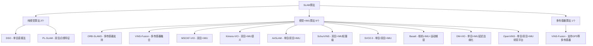
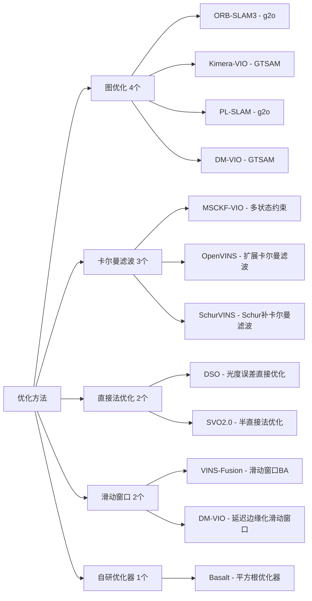
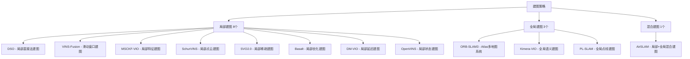

# VINS/SLAM算法实现与优化研究

这个仓库包含了多个视觉惯性导航系统(VINS)和SLAM算法的完整实现、Docker化配置、数据集标定和性能优化工作。

## 主要工作内容

### 🔧 算法实现与配置（主要工作1）

为每个算法完成了以下实际工作：

#### Docker化环境配置
- 为每个算法创建了完整的Docker环境
- 包含 `docker-compose.yml` 和 `Dockerfile`
- 确保环境一致性和可重现性

#### 数据集标定与配置
- 重新标定了各个数据集（CERBERUS等）
- 创建了针对性的标定配置文件
- 优化了不同数据集的参数设置

#### 自动化运行脚本
- 开发了自动化测试和运行脚本
- 包含单序列和批量处理脚本
- 简化了算法测试流程

#### 性能测试与结果分析
- 完成了各算法的性能测试
- 收集了详细的测试结果和性能数据
- 识别了收敛性问题（当前正在调优阶段）

### 📚 理论研究与学习（主要工作2）

#### 深入学习笔记
- 详细的MSCKF算法原理分析
- OpenVINS等算法的代码实现解析
- 数学基础推导和理论分析

#### 算法比较研究
- 不同算法的性能对比分析
- 优缺点和适用场景研究
- 收敛性和稳定性分析

## 包含的算法

### 算法概览

本项目包含12个主流SLAM/VINS算法，按技术特点和应用场景分类如下：

#### 🔧 按传感器配置分类



#### 🎯 按优化方法分类



#### 🏗️ 按建图策略分类



### 详细算法对比表

| 算法 | 年份 | 传感器配置 | 特征类型 | 优化方法 | 建图策略 | 成熟度 | 复杂度 | 鲁棒性 | 实时性 | 主要特点 |
|------|------|------------|----------|----------|----------|--------|--------|--------|--------|----------|
| **ORB-SLAM3** | 2021 | 多传感器 | 点特征 | 图优化 | 全局 | 高 | 中 | 高 | 中 | 多地图系统，回环检测，功能全面 |
| **VINS-Fusion** | 2019 | 多传感器 | 点特征 | 滑动窗口 | 局部 | 高 | 中 | 高 | 中 | 多传感器融合，GPS支持 |
| **MSCKF-VIO** | 2017 | 双目+IMU | 点特征 | 卡尔曼滤波 | 局部 | 高 | 低 | 高 | 高 | 多状态约束，实时性好 |
| **Kimera-VIO** | 2020 | 双目+IMU | 点特征 | 图优化 | 全局 | 中 | 中 | 高 | 中 | 语义SLAM，度量语义建图 |
| **DSO** | 2016 | 单目 | 直接法 | 直接法 | 局部 | 高 | 高 | 低 | 低 | 经典直接法，像素级优化 |
| **AirSLAM** | 2024 | 单目/双目+IMU | 点+线 | 混合 | 混合 | 中 | 高 | 中 | 中 | 深度学习+传统优化混合 |
| **SchurVINS** | 2024 | 双目+IMU | 点特征 | 卡尔曼滤波 | 局部 | 中 | 低 | 中 | 高 | 轻量级，Schur补优化 |
| **SVO2.0** | 2017 | 单目/双目+IMU | 半直接法 | 半直接法 | 局部 | 中 | 中 | 中 | 高 | 高帧率设计，半直接法 |
| **PL-SLAM** | 2017 | 双目 | 点+线 | 图优化 | 全局 | 中 | 中 | 中 | 中 | 点线特征融合，低纹理环境 |
| **Basalt** | 2019 | 相机+IMU | 点特征 | 自研优化 | 局部 | 中 | 高 | 中 | 低 | 非线性因子恢复，数值稳定 |
| **DM-VIO** | 2022 | 单目+IMU | 点特征 | 滑动窗口 | 局部 | 中 | 中 | 中 | 中 | 延迟边缘化，计算效率高 |
| **OpenVINS** | 2020 | 单目/双目+IMU | 点特征 | 卡尔曼滤波 | 局部 | 中 | 低 | 中 | 高 | 研究平台，模块化设计 |

### 🎯 应用场景推荐

#### 通用机器人导航
- **推荐**: ORB-SLAM3, VINS-Fusion, Kimera-VIO
- **理由**: 功能全面，鲁棒性好，支持多种传感器

#### 无人机快速飞行
- **推荐**: MSCKF-VIO, SchurVINS, SVO2.0
- **理由**: 实时性好，计算效率高

#### 嵌入式设备
- **推荐**: AirSLAM, SchurVINS, OpenVINS
- **理由**: 轻量级设计，资源消耗少

#### 低纹理环境
- **推荐**: PL-SLAM, AirSLAM
- **理由**: 点线特征融合，增强低纹理环境性能

#### 高精度应用
- **推荐**: ORB-SLAM3, VINS-Fusion, Kimera-VIO
- **理由**: 全局优化，精度高

#### 实时性要求高
- **推荐**: MSCKF-VIO, SchurVINS, SVO2.0
- **理由**: 计算效率高，实时性好

## 项目结构

```
├── DM_VIO/                    # DM-VIO算法实现
│   ├── docker-compose.yml     # Docker配置
│   ├── configs/               # 标定配置文件
│   ├── Results_dmvio/         # 测试结果
│   └── run_cerberus_*.sh      # 运行脚本
├── OpenVINS/                  # OpenVINS实现
│   ├── docker-compose.yml     # Docker配置
│   ├── CERBERUS_README.md     # 使用说明
│   └── Results_ov/            # 测试结果
├── STUDY/                     # 研究笔记和理论分析
│   ├── notes/                 # 详细学习笔记
│   ├── algorithms/            # 算法原理分析
│   └── comparisons/           # 算法比较研究
└── [其他算法目录...]          # 每个算法都有类似结构
```

## 当前工作状态

### ✅ 已完成
- [x] 所有算法的Docker环境配置
- [x] 数据集标定和配置文件创建
- [x] 自动化运行脚本开发
- [x] 初始性能测试和问题识别
- [x] 基础理论学习和笔记整理

### 🔄 进行中
- [ ] 参数调优（解决收敛性问题）
- [ ] 性能优化和稳定性改进
- [ ] 深入算法原理分析

### ⏳ 计划中
- [ ] 完整的性能比较报告
- [ ] 算法优化建议和最佳实践
- [ ] 理论研究成果总结

## 使用方法

### 快速开始
```bash
# 进入任意算法目录
cd DM_VIO

# 使用Docker运行
docker-compose up

# 或使用提供的脚本
./run_cerberus_single.sh
```

### 查看结果
每个算法目录下的 `Results_*/` 文件夹包含详细的测试结果和性能数据。

## 研究笔记

- `STUDY/notes/` - 包含详细的算法学习笔记
- `STUDY/algorithms/` - 算法原理和数学基础分析
- `STUDY/comparisons/` - 算法性能比较研究

## 贡献

这个项目展示了在VINS/SLAM算法实现、Docker化部署、性能优化等方面的实际工作经验。每个算法都经过了完整的配置、测试和优化过程。

## 许可证

请参考各个子项目的许可证文件。本项目主要用于研究和学习目的。
