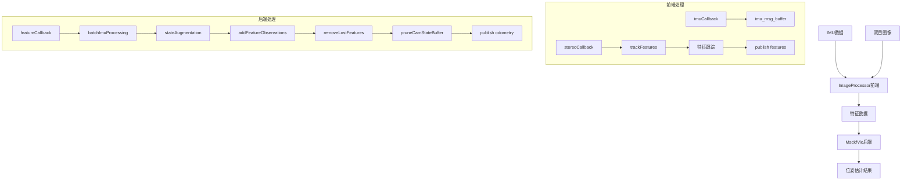
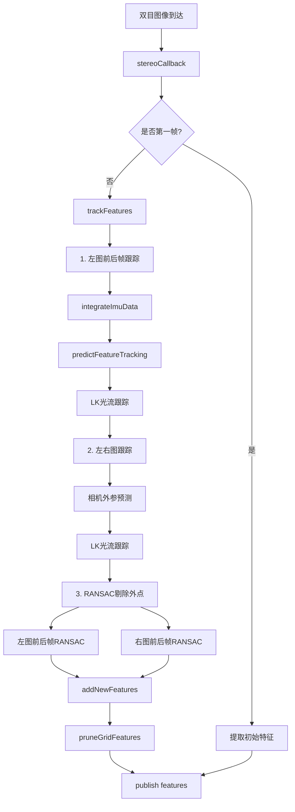
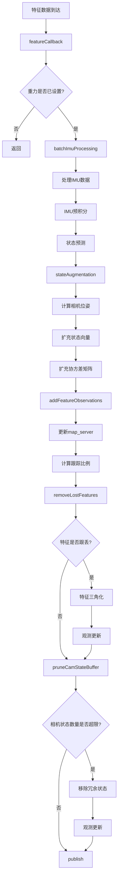
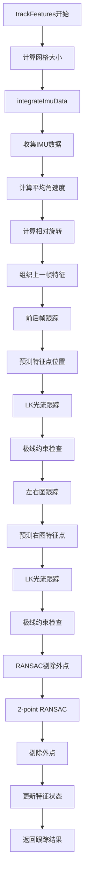
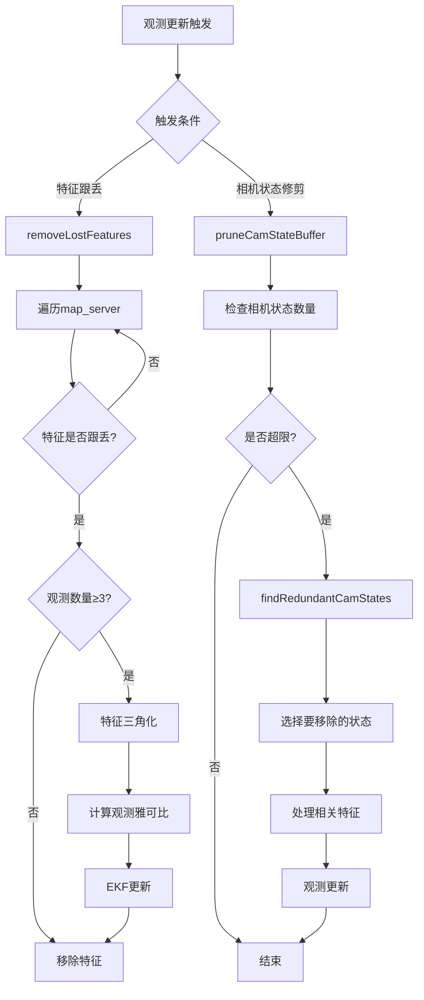
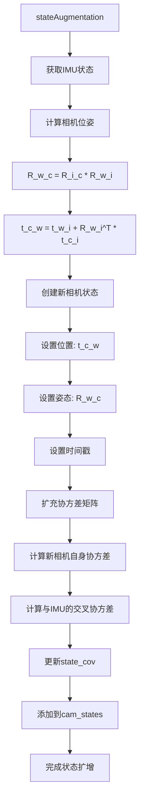
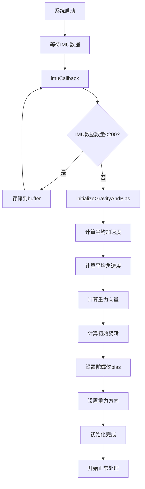
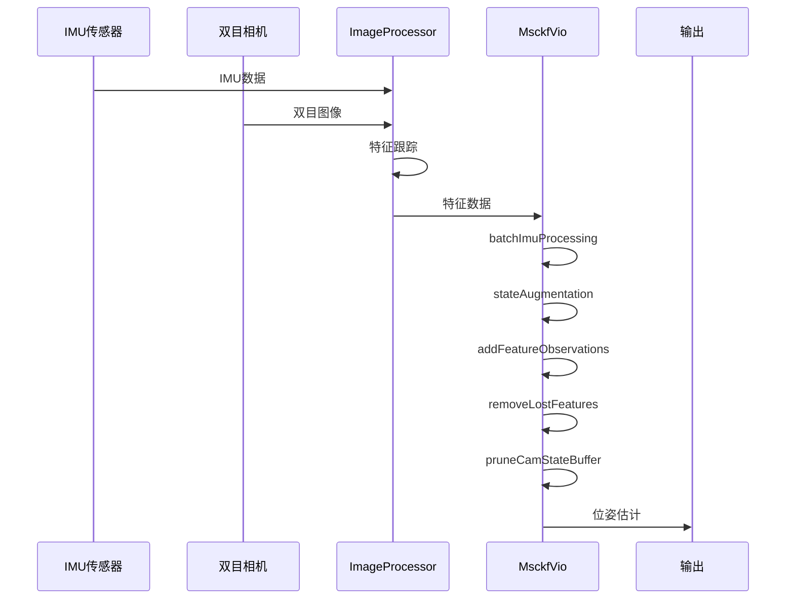

# MSCKF 数据流和逻辑流程图 (Mermaid格式)

## 1. 整体系统架构

## 2. 前端特征跟踪流程

## 3. 后端主处理流程

## 4. 特征跟踪详细流程

## 5. 观测更新流程

## 6. 状态扩增流程

## 7. 初始化流程

## 8. 数据流时序图

这些流程图清晰地展示了MSCKF算法的数据流和逻辑结构，帮助你理解代码的整体架构和各个模块之间的交互关系。

